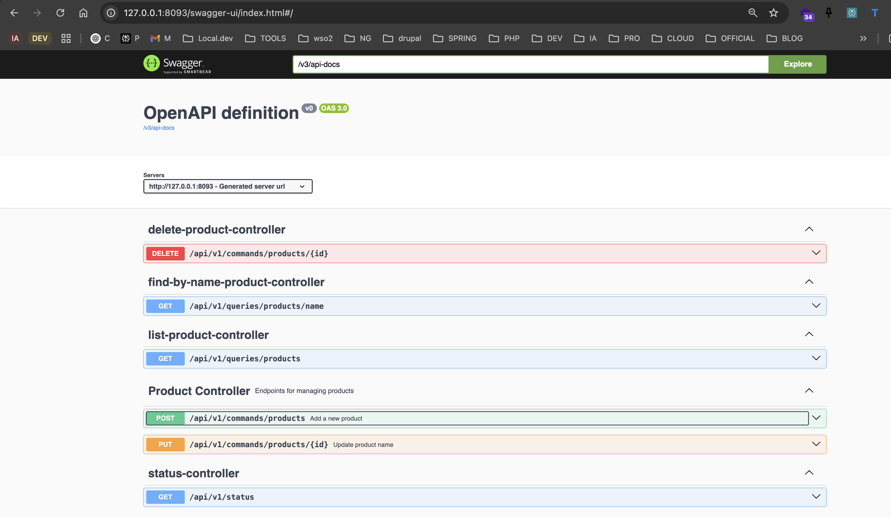
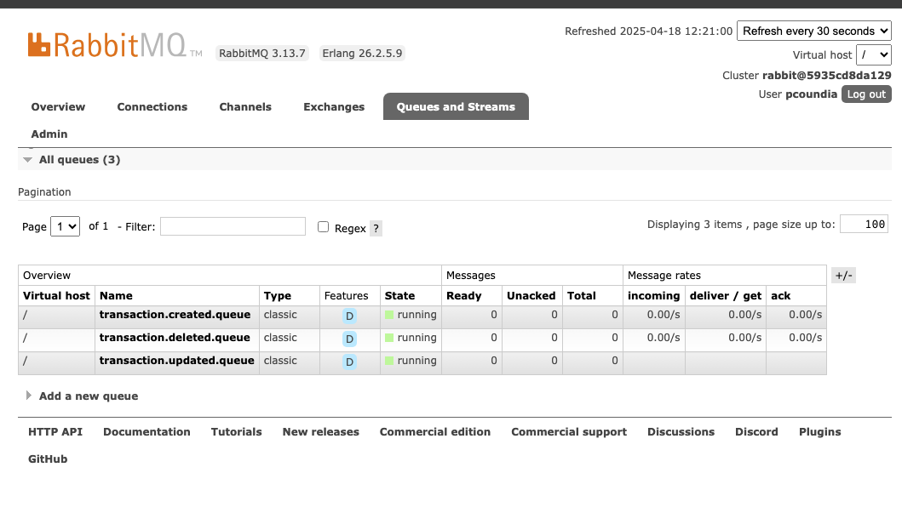

# spring-axon-rabbitmq-starter

This project is a **Spring Boot** application using **Axon Framework**, **RabbitMQ**, and **PostgreSQL**, following *
*DDD** (Domain-Driven Design) and **CQRS** (Command Query Responsibility Segregation) principles.

## 📥 Clone the Project

```sh
git clone https://github.com/coundia/spring-axon-rabbitmq-starter.git
cd spring-axon-rabbitmq-starter
```

## 📌 Prerequisites

Before running the application, make sure you have installed:

- [Docker](https://www.docker.com/)
- [Docker Compose](https://docs.docker.com/compose/)
- [Maven](https://maven.apache.org/)

## 🚀 Installation and Execution

### 1️⃣ Start PostgreSQL and RabbitMQ

Run the following command to start the Docker containers:

```sh
docker compose -f docker/main.yml up -d
```

### 2️⃣ Run Tests

```sh
mvn spring-boot:test-run
```

### 3️⃣ Start the Spring Boot Application

```sh
mvn spring-boot:run
```

## 📡 API Documentation

Once the application is running, you can access the **Swagger UI** documentation here:

🔗 http://127.0.0.1:8093/swagger-ui/index.html#/

## Api documentation swagger




## RabbitMQ Management

http://localhost:15672/#/queues




## 📁 Project Structure

```
❰pcoundia❙~/projects/spring-axon-rabbitmq-web-jpa-starter(git✱main)❱✔≻ tree -L 7 src/
src/
├── main
│   ├── java
│   │   └── com
│   │       └── groupe2cs
│   │           └── bizyhub
│   │               ├── BizyhubApplication.java
│   │               ├── products
│   │               │   ├── application
│   │               │   ├── domain
│   │               │   ├── infrastructure
│   │               │   └── presentation
│   │               └── shared
│   │                   ├── Presentation
│   │                   └── infrastructure
│   └── resources
│       ├── application-test.properties
│       └── application.properties
└── test
    └── java
        └── com
            └── groupe2cs
                └── bizyhub
                    ├── BizyhubApplicationTests.java
                    ├── application
                    │   └── CreateProductCommandTest.java
                    ├── domain
                    │   └── ProductModelTests.java
                    ├── infrastructure
                    │   └── controller
                    └── shared
                        ├── BaseIntegrationTests.java
                        └── BaseUnitTests.java

25 directories, 8 files

```

## 🔹 Notes

- The application follows the **CQRS pattern**, separating command and query models.
- **RabbitMQ** is used as a **message broker** for event-driven communication.
- **PostgreSQL** is the primary database.

## 📜 License

CC-BY-NC-SA-4.0
